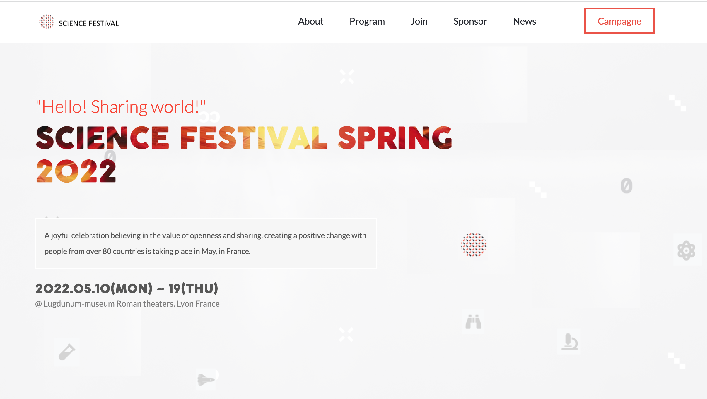

# Science Festival WebSite

> HTML/CSS & JavaScript capstone project - Conference page
> In this capstone project, we are going to build an online website for a conference based on the following [Template](https://www.behance.net/gallery/29845175/CC-Global-Summit-2015)

Additional description about the project and its features.

## Built With

- HTML
- CSS
- JS

## Live Demo

[Live Demo Link](https://jihaneh.github.io/ScienceFestivalWeb)

## Getting Started

**This is an example of how you may give instructions on setting up your project locally.**
**Modify this file to match your project, remove sections that don't apply. For example: delete the testing section if the currect project doesn't require testing.**

To get a local copy up and running follow these simple example steps.

### Prerequisites

### Setup

### Install

### Usage

### Run tests

### Deployment

## Authors

👤 **JihaneH**

- GitHub: [@githubhandle](https://github.com/jihaneH)
- Twitter: [@twitterhandle](https://twitter.com/jijihaddad)
- LinkedIn: [LinkedIn](https://linkedin.com/in/jihane-haddad/)

## 🤝 Contributing

Contributions, issues, and feature requests are welcome!

Feel free to check the [issues page](../../issues/).

## Show your support

Give a ⭐️ if you like this project!

## Acknowledgments

- Designed by [Cindy Shin in Behance](https://www.behance.net/gallery/29845175/CC-Global-Summit-2015)
- Fond vector created par [freepik](https://fr.freepik.com/vecteurs/fond)
- Fond vector created par [pressfoto](https://fr.freepik.com/photos/femme)

## 📝 License

This project is [MIT](./MIT.md) licensed.
